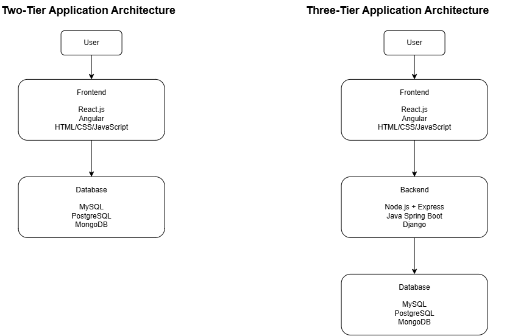
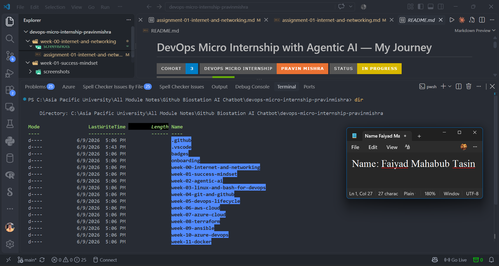

# Week 00 - Internet and Networking

Part of the DevOps Micro Internship (DMI) with Agentic AI

---

# 🧑‍💻 Task 1: Using ChatGPT as Your Learning Assistant

## Scenario

You're new to DevOps and will frequently encounter technical questions. ChatGPT can be your learning companion.

## Your Task

Write a clear ChatGPT prompt to help you understand:

> "What is a protocol in networking? Explain with a simple real-life example."

Take a screenshot of your interaction showing:

* Your detailed prompt (with clear expectations)
* ChatGPT's simplified response with an example

## Screenshot

Save your screenshot in the `screenshots` folder and update the file name below.


Replace `task-1-chatgpt.png` with your actual screenshot file name.

---

## What I Learned (2–3 lines)...
Protocol is a set of riules that devices follow when communicating with each other where it is like a language set of manners when two computers wants to exchange information they agree on a set of rules that follow:
How to start the conversation


How to send the informati

on
How to understand the inform

ation
What to do when something go

es wrong
How to finish the communication


---

# 🌐 Task 2: Internet and Networking

## Scenario

Your friend is launching an online bookstore named **EpicReads**.

He asked you to explain how users globally can access his website hosted in Finland.

## Your Task

Write a short explanation (**100–150 words**) that includes:

* Packet Switching
* IP Address
* TCP/IP
* HTTP/HTTPS

💡 **Tip:** You may use ChatGPT (as demonstrated in Task 1) to refine your explanation.

## Answer

When a user visits the EpicReads website hosted in Finland, the request travels through the Internet using **packet switching**. This means the data is divided into small packets, which travel through different network paths and are reassembled at the destination.

Every device connected to the Internet has an **IP address**, which works like a unique address that helps identify and locate the EpicReads server. The communication between the user and server is managed by the **TCP/IP protocol suite**. TCP ensures that data packets arrive correctly and in order, while IP handles addressing and routing.

When users open the website, their browser uses **HTTP/HTTPS** protocols to request and securely receive web pages from the server. HTTPS provides encryption, protecting information exchanged between users and EpicReads.


---

# 🏗️ Task 3: Application Architecture & Stack

## Scenario

EpicReads bookstore has two application versions:

### Two-Tier Application

* Frontend
* Database

### Three-Tier Application

* Frontend
* Backend
* Database

## Your Task

* Draw simple diagrams (hand-drawn or tool-based such as draw.io)
* Label each layer clearly
* List at least two common technologies or tools used for each layer
* Submit a screenshot or photo clearly showing your own drawing

## Diagram Screenshot / Photo

Save your diagram image in the `screenshots` folder and update the file name below.




Replace `task-3-diagram.png` with your actual diagram file name.

---

## Technologies Used

### Frontend

* React.js – A JavaScript library used to build interactive user interfaces.
* Angular – A framework for developing structured web applications.

* HTML/CSS/JavaScript – Core web technologies used for creating webpage structure, styling, and client-side functionality.
### Backend

* Node.js with Express – Node.js + Express.js – A backend runtime and framework used to build APIs, handle server-side logic, and communicate between the frontend and database.
* Java Spring Boot – A Java-based framework used for developing secure and scalable backend services.
*Django – A Python web framework used for rapid development of backend applications with built-in security features. 

### Database

* MySQL – A relational database management system used to store structured application data using tables and SQL queries..
* PostgreSQL – An advanced open-source relational database known for reliability, scalability, and complex data handling.
* MongoDB – A NoSQL document database used for storing flexible, JSON-like data structures.

---

# 🌍 Task 4: Domain Name & DNS (Basic Concepts)

## Scenario

Your friend's bookstore **EpicReads** is currently accessible through:

```text
52.172.142.222:3000
```

He purchased the domain:

```text
epicreads.com
```

## Your Task

In **50–100 words**, explain in your own words:

1. What is DNS (Domain Name System)?
2. Which DNS record type should be used to connect the domain to the given IP, and why?

## Answer

DNS (Domain Name System) is a system that converts human-readable domain names into IP addresses that computers use to identify servers on the Internet. Instead of remembering a numeric IP address such as 52.172.142.222, users can access the website using the easier-to-remember domain name epicreads.com.

To connect epicreads.com to the server's IP address, an A record should be used because it maps a domain name to an IPv4 address. The DNS A record will point epicreads.com to 52.172.142.222, allowing users to access the EpicReads website through its domain name.

---

# 💻 Task 5: Visual Studio Code Setup (Hands-on)

## Your Task

Install Visual Studio Code (if not already installed).

Take a screenshot of your VS Code environment showing:

* Terminal open inside VS Code
* Running a basic command:

### Windows

```powershell
dir
```

### Linux / macOS

```bash
pwd
ls
```

* Your selected VS Code theme clearly visible

⚠️ **Important:** The screenshot must show your username or another identifiable detail to confirm it is your environment.

## Screenshot

Save your screenshot in the `screenshots` folder and update the file name below.




Replace `task-5-vscode.png` with your actual screenshot file name.

---

# 🔗 Task 6: Publish Your Assignment as a LinkedIn Post

## Objective

Publishing on LinkedIn helps you:

* Build your professional online presence
* Reinforce your learning
* Document your DevOps journey publicly

## Your Task

Summarize your answers from Tasks 1–5 into a LinkedIn post.

Clearly structure your post into the following sections:

* ChatGPT
* Internet & Networking
* App Architecture
* DNS
* VS Code Setup

Use the credit note that matches your track:

Add the following credit note at the end of your post **(If you are DMI Cohort 3 student)**:

> **P.S. This post is part of the DevOps Micro Internship (DMI) with Agentic AI — Cohort 3 — by Pravin Mishra. My graded progress is public: https://dmi.pravinmishra.com/s/faiyaadmahabub-hash.html · Start your DevOps journey: https://dmi.pravinmishra.com/?utm_source=student&utm_medium=ps-linkedin&utm_campaign=cohort3**

**Tag [Pravin Mishra](https://www.linkedin.com/in/pravin-mishra-aws-trainer/) in your LinkedIn post, then tag Lead Co-Mentor — [Anjana Muthunayake](https://www.linkedin.com/in/anjana-muthunayake/).**

Add the following credit note at the end of your post **(If you are DMI Self-paced track student)**:

> **P.S. This post is part of the DevOps Micro Internship (DMI) — Self-Paced Engineer Track — by Pravin Mishra. My graded progress is public: https://dmi.pravinmishra.com/s/YOUR-GITHUB-USERNAME.html · Start your DevOps journey: https://dmi.pravinmishra.com/?utm_source=student&utm_medium=ps-linkedin&utm_campaign=self-paced**

Add the following credit note at the end of your post **(If you are DMI Campus student)**:

> **P.S. This post is part of the DevOps Micro Internship (DMI) — Campus — by Pravin Mishra. My graded progress is public: https://dmi.pravinmishra.com/s/YOUR-GITHUB-USERNAME.html · Start your DevOps journey: https://dmi.pravinmishra.com/?utm_source=student&utm_medium=ps-linkedin&utm_campaign=campus**

**Tag [Pravin Mishra](https://www.linkedin.com/in/pravin-mishra-aws-trainer/) in your LinkedIn post, then tag Lead Co-Mentor — [Anjana Muthunayake](https://www.linkedin.com/in/anjana-muthunayake/).**

Hashtags:

#DMIByPravinMishra #AgenticAI #DevOps

Replace `YOUR-GITHUB-USERNAME` with your GitHub username — that link is your public DMI progress page (your graded badge page).
---

## LinkedIn Post URL

Paste your LinkedIn post URL here:

```text
https://lnkd.in/p/gVGZH2cb
```

---

## LinkedIn Post Backup Copy

Week 0 — Internet and Networking Fundamentals

I recently completed Week 0 of the DevOps Micro Internship (DMI) — Cohort 3, where I focused on building a foundation in Internet and Networking concepts.
 
This week helped me understand how modern applications communicate, how different system layers work together, and how developers interact with essential tools.

ChatGPT as a Learning Assistant

I explored how effective prompting can help simplify technical concepts. I learned how networking protocols define the rules that allow devices to communicate and exchange information reliably.

Internet & Networking

I studied important networking concepts including packet switching, IP addressing, TCP/IP, and HTTP/HTTPS to understand how data travels between users and servers across the Internet.

App Architecture

I learned the differences between two-tier and three-tier application architectures and how frontend, backend, and database layers work together. I also explored common technologies used in these layers, including React.js, Angular, Node.js, Spring Boot, MySQL, PostgreSQL, and MongoDB.

DNS

I learned how the Domain Name System helps translate human-readable names into network addresses and how DNS records connect users with online services.

VS Code Setup

I configured my Visual Studio Code environment, practiced using the integrated terminal, and became more familiar with command-line workflows.
 
This first week provided me with a stronger understanding of the foundations behind software infrastructure and DevOps practices.
 
I look forward to building on these concepts through hands-on learning in Linux, cloud technologies, containers, automation, and CI/CD.

Mentor:
Pravin Mishra
Co Mentor:
Anjana Muthunayake

P.S. This post is part of the DevOps Micro Internship (DMI) with Agentic AI — Cohort 3 — by Pravin Mishra. My graded progress is public: https://lnkd.in/gVBiu7wW · Start your DevOps journey: https://lnkd.in/gtxEiPiv

#DMIByPravinMishra #DevOps #AgenticAI

---

# Reflection – Week 0

### What did you find easy?

I found the basic networking concepts and application architecture easy to understand, especially after relating them to practical examples such as how users connect to a website and how frontend, backend, and database layers work together.

---

### What was difficult?

The most difficult part was understanding how different networking concepts such as packet switching, TCP/IP, DNS, and HTTP/HTTPS work together during real communication between a user and a server..

---

### What will you improve next week?

Next week, I want to spend more time on hands-on practice, especially using the command line and understanding networking concepts in real scenarios instead of only learning the theory.

---

## 📌 About DMI & CloudAdvisory

DevOps Micro Internship (DMI) is a project-based DevOps program run by Pravin Mishra (The CloudAdvisory) focused on real-world execution, systems thinking, and career readiness.

It helps learners build strong DevOps foundations with hands-on experience.


## 📌 Resources

- 🌐 **DMI Official Website:** https://dmi.pravinmishra.com?utm_source=github&utm_medium=readme  
- 🎓 **University:** https://university.pravinmishra.com?utm_source=github&utm_medium=readme  
- 💬 **Discord Community:** https://discord.pravinmishra.com?utm_source=github&utm_medium=readme  
- 📝 **Blog:** https://dmi.pravinmishra.com/blog?utm_source=github&utm_medium=readme  
- ▶️ **YouTube Playlist (DMI Cohort 3):** https://www.youtube.com/playlist?list=PLFeSNDtI4Cho  
- 🔗 **Pravin Mishra (LinkedIn):** https://www.linkedin.com/in/pravin-mishra-aws-trainer/  
- 🏢 **CloudAdvisory (LinkedIn):** https://www.linkedin.com/company/thecloudadvisory/

---

*This submission is part of DevOps Micro Internship (DMI) — Agentic AI Track*